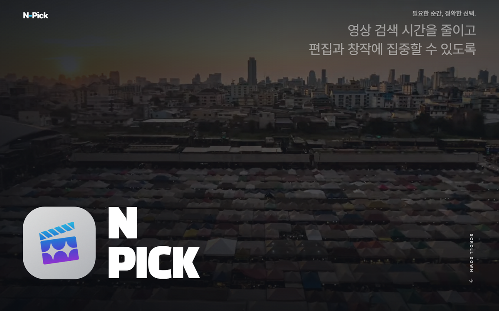
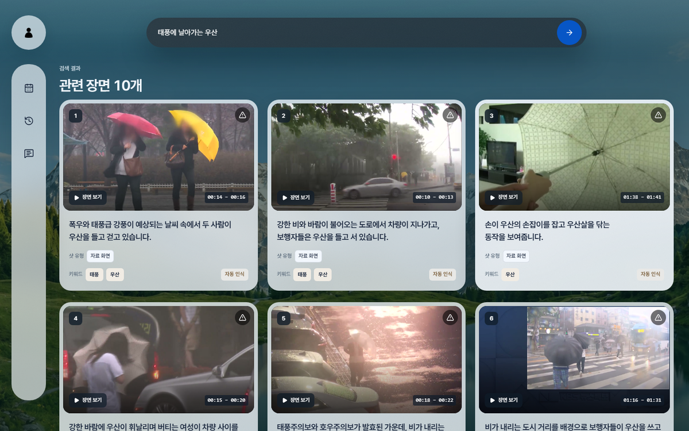
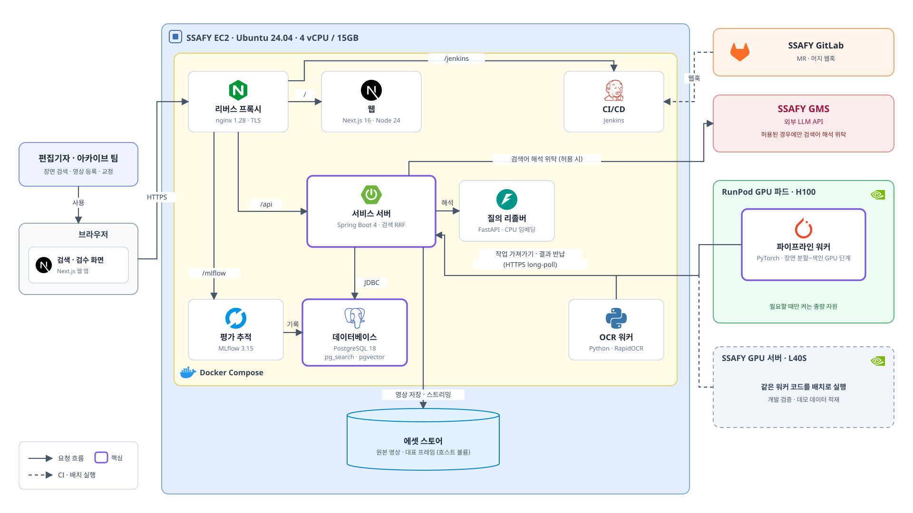
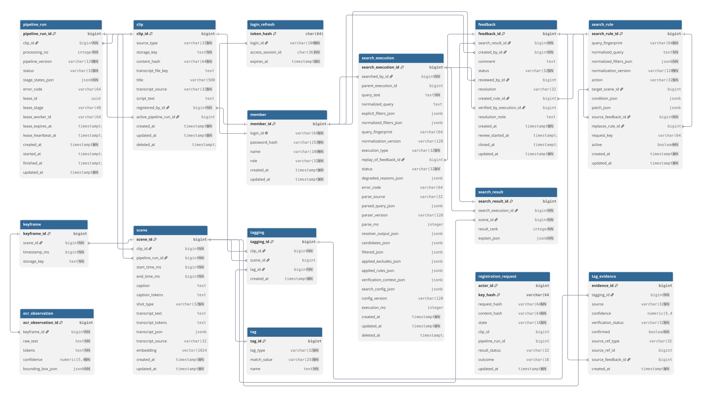
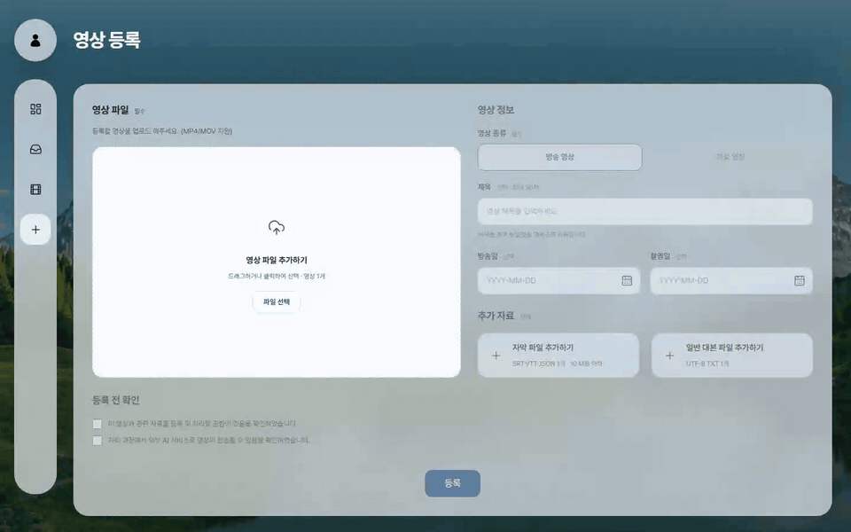
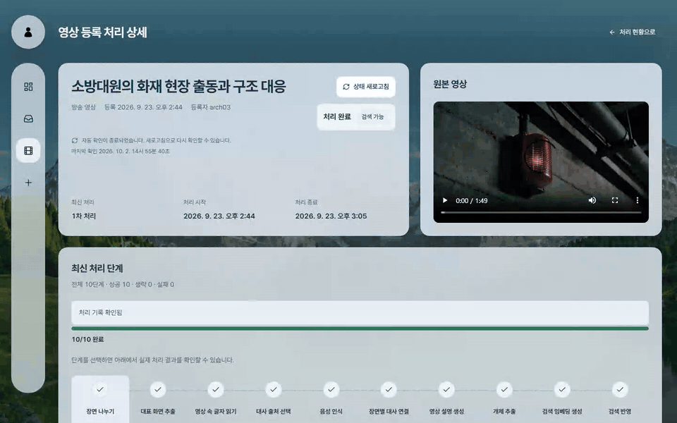
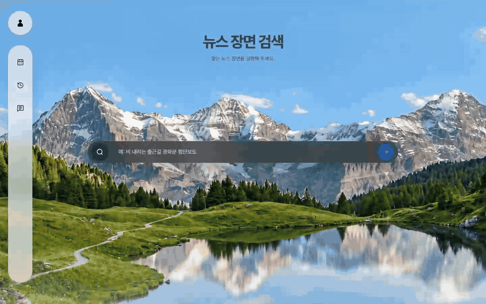
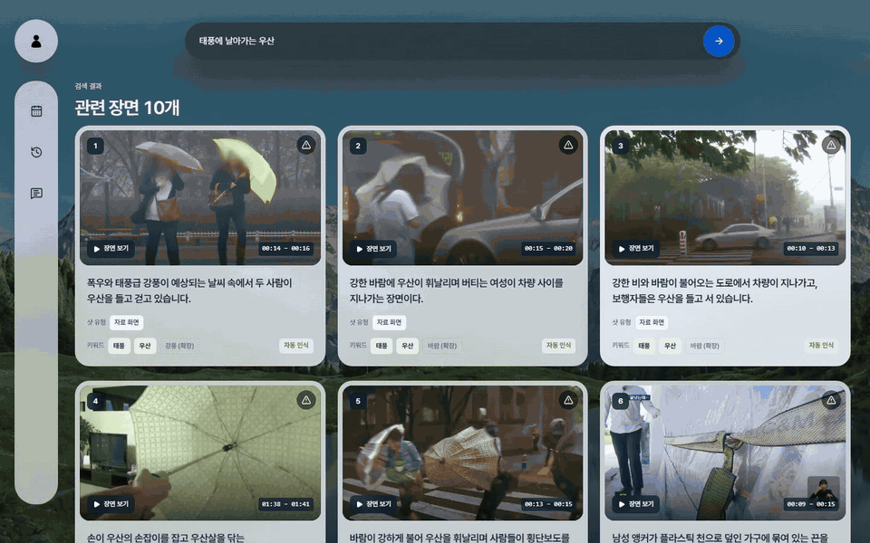
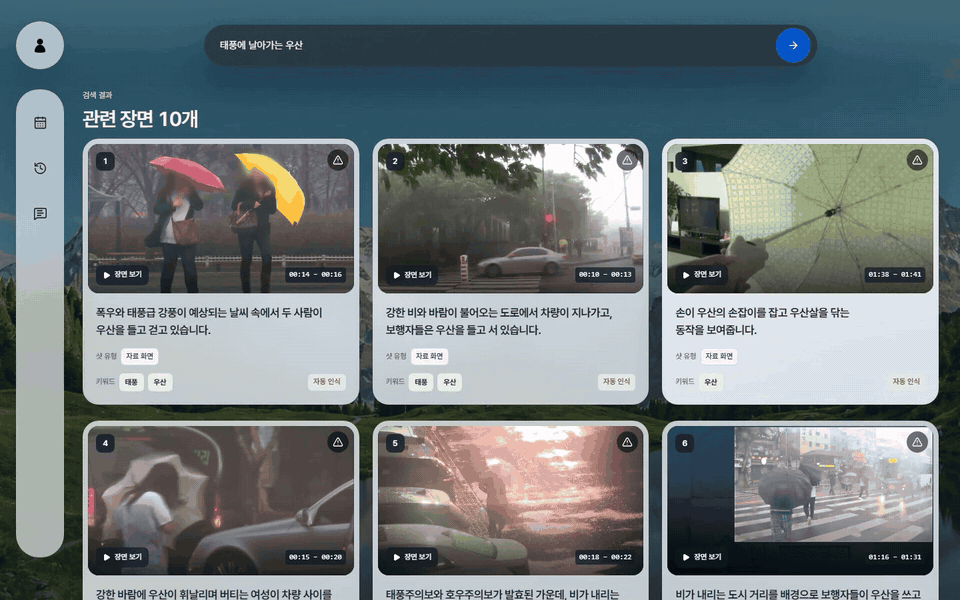
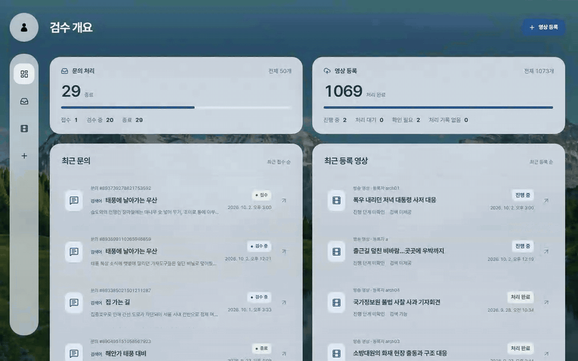

# N-Pick

> AI 기반 방송 영상 아카이빙 자동화 및 검색 보조 시스템

## 🎬 서비스 소개



- N-Pick(엔픽)은 방송 영상 아카이빙 서비스예요. 영상을 올리면 AI가 장면마다 설명과 태그를 달아 두고, 편집기자는 평소 말하듯 문장으로 원하는 장면을 찾을 수 있어요.
- "태풍에 날아가는 우산"처럼 검색하면 영상 전체가 아니라 해당 장면 구간만 보여 줘요.
- 검색 결과가 이상하면 바로 문의할 수 있고, 아카이브 팀이 고친 내용은 다음 검색부터 반영돼요.
- 사용자는 편집기자와 아카이브 팀 두 역할로 나뉘어요.

### 프로젝트 기간

`2026.08.31 ~ 2026.10.02`

### 수상

우수상 수상 (서울 5반 1등)

## 목차

- [📼 4,800분을 봐야 50분이 나온다](#-4800분을-봐야-50분이-나온다)
- [🔎 "경찰 시민" 대신 "길 안내하는 경찰"로 찾기까지](#-경찰-시민-대신-길-안내하는-경찰로-찾기까지)
- [🛠 기술 스택](#-기술-스택)
- [🏗 아키텍처](#-아키텍처)
- [📁 폴더 구조](#-폴더-구조)
- [🗂 ERD](#-erd)
- [📦 실행 방법](#-실행-방법)
- [📖 API 명세](#-api-명세)
- [📺 핵심 기능](#-핵심-기능)
- [👥 팀원](#-팀원)
- [📌 컨벤션](#-컨벤션)

## 📼 4,800분을 봐야 50분이 나온다

「다큐 3일」 50분짜리 한 편을 만들려면 원본 영상 4,800분을 봐야 한다고 합니다. 실제로 방송에 나가는 분량은 그중 1%뿐이에요. 현직 방송국 편집기자를 인터뷰했을 때도 편집보다 장면을 찾는 데 시간이 더 오래 걸린다는 이야기를 들었습니다.

방송국에도 검색 시스템은 있습니다. 하지만 사람이 영상마다 촬영 대상, 상황, 촬영 방식을 직접 적어 두고, 이 설명을 키워드로만 찾는 방식입니다. "경찰이 시민에게 길을 안내하는 장면"을 찾으려고 `경찰 시민`을 입력하면 길 안내와 상관없는 영상이 잔뜩 나옵니다. 키워드만으로는 장면의 맥락을 담을 수 없기 때문입니다.

그래서 영상 설명은 AI가 대신 쓰고, 검색은 문장의 의미까지 이해하도록 만들기로 했습니다.

## 🔎 "경찰 시민" 대신 "길 안내하는 경찰"로 찾기까지

> 단어 검색과 의미 검색을 PostgreSQL 하나에서 함께 돌리고, 두 검색의 순위를 RRF로 합치기까지의 과정입니다.

### [BE] ParadeDB BM25와 pgvector를 RRF로 묶은 하이브리드 검색

- **문제**
  - 한국어는 조사와 어미가 붙기 때문에 뜻이 같아도 문장 형태가 제각각입니다. 단어 검색만 쓰면 표현이 조금만 달라도 장면을 놓치고, 의미 검색만 쓰면 "주민들이 대피하는 장면"을 찾을 때 "주민들이 더위를 피하는 장면"까지 함께 나옵니다.
  - 검색이 끝나면 결과와 실행 상태를 하나의 트랜잭션으로 저장해야 합니다. 검색 엔진을 따로 두면 두 저장소의 데이터를 맞추는 작업(outbox, 재동기화)이 계속 따라붙습니다.
- **해결**
  - 검색 엔진을 따로 두지 않고, 서비스 DB에 PostgreSQL 확장인 `pg_search`(ParadeDB, Tantivy 기반 BM25)와 `pgvector`를 함께 설치했습니다.
  - `pg_search`에 들어 있는 한국어 토크나이저 `lindera(korean)`는 조사를 분리하지 못했습니다. `정체를`로 검색하면 상관없는 문서가 `를` 하나만으로 정답보다 높은 점수를 받았습니다. 그래서 형태소 분석은 워커가 Kiwi로 미리 해서 별도 컬럼에 저장하고, DB는 공백 기준(`pdb.whitespace`)으로만 색인하도록 바꿨습니다. 색인할 때와 검색할 때 Kiwi 설정이 같아야 하므로, 이 설정은 `search_version`으로 함께 관리합니다.
  - 두 검색의 순위는 `R(d) = Σ w_c / (k + rank_c)`로 합칩니다(`k = 60`). 점수를 정규화할 때 분모는 실제로 나온 최고점이 아니라 설정값으로 계산합니다. 후보가 적은 검색에서 점수가 부풀려져 검색끼리 비교할 수 없게 되는 문제를 막기 위해서입니다.
- **결과**
  - 현재 사용 중인 색인 버전(`generation_id`)으로 거르는 조건이 BM25 검색 안에서 함께 처리되어 `1.5ms` 만에 끝납니다. 색인을 교체할 때 별칭(alias)을 따로 둘 필요도 없어졌습니다.
  - 순위 계산과 결과 저장을 한 프로세스, 한 트랜잭션 안에서 처리할 수 있게 됐습니다.
- 설계 근거는 [02 Container 문서](docs/architecture/02-container.md#주목할-아키텍처-결정)에 정리했습니다. RRF 산식 커밋은 [d2b56081](https://github.com/eomgerm/N-Pick/commit/d2b56081)입니다.

### [BE] 근거 없이 끼어들던 검색 결과 걸러 내기

- **문제**
  - 의미 검색 후보를 거르는 거리 기준이 `distance <= 2`로 고정돼 있었습니다. 코사인 거리가 가질 수 있는 범위 전체라서 사실상 아무것도 거르지 못했고, 단어 검색 결과가 0건인 검색어에서도 결과 10개가 의미 검색 결과로 모두 채워졌습니다.
  - 운영 기록(검색 229회, 결과 2,290건)을 확인해 보니 결과의 `30.2%`가 검색어와 겹치는 단어도, 태그 점수도 없는 결과였습니다.
- **해결**
  - 운영 중에 실제로 들어온 검색어 27개를 직접 임베딩해 거리를 측정했습니다. 1위 결과의 거리는 찾는 영상이 있는 검색어가 `0.45~0.61`, 없는 검색어가 `0.76~0.79`, 의미 없는 검색어가 `0.83`이었습니다.
  - 그 사이 값인 `0.75`를 기준으로 정하고 `max-distance` 설정으로 분리했습니다. 벡터 유효성 검사에는 이 기준을 적용하지 않았습니다. 함께 적용하면 유사도가 낮은 장면이 손상된 벡터로 집계되어 모든 검색이 부분 실패로 처리되기 때문입니다.
- **결과**
  - 근거 없이 끼어들던 결과의 `72%`가 사라졌습니다.
- 측정 과정 → [1aac9cf3](https://github.com/eomgerm/N-Pick/commit/1aac9cf3)

### [BE] "중국 음식"이 "중국 OR 음식"으로 쪼개지던 문제

- **문제**
  - LLM이 뽑은 유사어 중 여러 단어로 된 것이 BM25 검색 직전에 낱말 단위로 풀리면서, 「중국 음식」이 `중국 OR 음식`으로 검색됐습니다. 그래서 두 단어 중 하나만 들어 있어도 후보가 됐습니다.
- **해결**
  - 유사어를 여러 단어 묶음(`List<List<String>>`) 그대로 넘기도록 바꾸고, 같은 묶음 안의 단어는 AND, 묶음끼리는 OR로 검색했습니다. 너무 흔한 단어를 빼는 문서 빈도 기준도 넣어 봤지만, 묶음 안의 단어까지 지워 AND 조건을 일부 무너뜨리는 걸 확인하고 다시 뺐습니다.
- **결과**
  - 운영 DB에서 「중국 음식」으로 잘못 걸리던 결과가 `19건 → 0건`으로 줄었고, 불·비·산 같은 정상적인 유사어는 그대로 검색됩니다.
- 커밋 → [e3163140](https://github.com/eomgerm/N-Pick/commit/e3163140)

### [AI] 표기만 다른 같은 검색어가 서로 다르게 분석되던 문제

- **문제**
  - "부산시 교통사고"는 `교통사고 부산`으로, "부산 교통사고"는 `교통 부산 사고`로 서로 다르게 분석됐습니다. 별칭(부산시 → 부산)을 바꾸는 작업이 형태소 분석 뒤에 일어나면서, 뒤에 오는 단어를 나누는 방식까지 바뀌었기 때문입니다.
  - 기존 테스트는 7쌍만 확인했는데, 마침 문제가 없는 조합만 들어 있어서 CI에서 걸러지지 않았습니다.
- **해결**
  - 별칭 34개와 뒤에 붙는 단어 20개의 모든 조합을 돌려 보고, 별칭 값을 Kiwi 사용자 사전에 추가했습니다(`38 → 1`). 남은 1건은 사용자 사전 점수를 `3.0`으로 조정해 해결했습니다.
- **결과**
  - 어긋나는 조합이 `38/680 → 0`이 됐습니다. 모든 조합을 확인하는 검사를 테스트로 남겨 사전을 고쳐도 다시 깨지지 않게 했습니다.
- 커밋 → [216a9793](https://github.com/eomgerm/N-Pick/commit/216a9793)

### [AI] 자막이 1ms 모자라 영상 전체에 음성 인식이 돌던 문제

- **문제**
  - 자막을 영상 끝까지 붙였는데도 음성 인식(ASR)이 영상 전체를 다시 돌렸습니다. 백엔드는 자막 종료 시각을 ffprobe로 잰 영상 길이(`15181.833ms`)로 검사하고, 파이프라인은 프레임 수로 계산한 길이(`15182ms`)로 자막이 영상을 다 덮는지 확인했기 때문입니다. 자막을 15182ms까지 달면 백엔드가 거절하고, 15181ms에서 끝내면 마지막 1ms가 자막 없는 구간으로 남았습니다.
- **해결**
  - b-roll 클립 60개에서 두 길이의 차이를 재 보니 최소 `-0.467ms`, 최대 `+0.500ms`로 반올림 오차뿐이었습니다. 끝에 남는 빈틈은 최대 1ms이므로, 자막이 없어도 넘어가는 최소 구간(`min_uncovered_ms`)을 `0 → 2`로 올렸습니다.
- **결과**
  - 자막이 영상 전체를 덮으면 더 이상 음성 인식을 돌리지 않습니다.
- 계산 과정 → [36622ecb](https://github.com/eomgerm/N-Pick/commit/36622ecb)

## 🛠 기술 스택


| 역할        | 종류                                                                                                                                                                                                                                                                                                                                                                                                                                                                                                                                                                                     |
| --------- | -------------------------------------------------------------------------------------------------------------------------------------------------------------------------------------------------------------------------------------------------------------------------------------------------------------------------------------------------------------------------------------------------------------------------------------------------------------------------------------------------------------------------------------------------------------------------------------- |
| 프런트엔드     |      |
| 백엔드       |                                                                                                                                                 |
| AI 파이프라인  |                                   |
| 모델        | VLM `Qwen3.5-9B` · ASR `faster-whisper large-v3-turbo` · OCR `RapidOCR(PP-OCRv5)` · 임베딩 `snowflake-arctic-embed-l-v2.0-ko` · NER `KPF-bert-ner` · 형태소 `Kiwi`                                                                                                                                                                                                                                                                                                                                                                                                                           |
| 데이터베이스·검색 |                                                                                                                                                                                                                                                                                               |
| 인프라·CI/CD |                                                                                                             |
| 평가        |                                                                                                                                                                                                                                                                                                                                                                                                                                                                                   |


## 🏗 아키텍처



검색은 p95 기준 10초 안에 끝나야 하는 동기 작업이고, 장면 분석은 클립 하나에 GPU를 몇 분씩 쓰는 비동기 작업입니다. 그래서 AI 코드는 저장소 하나에 두되, 배포는 검색어를 해석하는 질의 리졸버(EC2 상주)와 영상을 분석하는 파이프라인 워커(GPU)로 나눴습니다.

워커는 항상 먼저 요청을 보내는 쪽입니다. 서비스 서버가 연 작업 API에서 롱 폴링으로 작업을 가져가고, 주기적으로 신호(heartbeat)를 보내 작업 점유 기간(lease)을 늘립니다. 덕분에 GPU 서버에 외부에서 들어오는 포트를 열 필요가 없고, GPU 서버가 꺼져도 작업이 사라지지 않습니다. 원본 데이터 쓰기는 권한을 제한한 DB 함수(plpgsql)로만 합니다.

자세한 구조는 C4 문서 [01 Context](docs/architecture/01-context.md) · [02 Container](docs/architecture/02-container.md) · [03 Deployment](docs/architecture/03-deployment.md)에 있습니다.

## 📁 폴더 구조

`frontend → backend ← ai` — 브라우저는 nginx를 거쳐 서비스 서버만 호출하고, AI 워커도 DB에 직접 접근하지 않고 서비스 서버의 작업 API만 호출합니다.

<details class="orca-details">
<summary>펼쳐 보기</summary>

```text
├── frontend                  # Next.js 웹 (편집기자 검색 화면, 아카이브 팀 처리·문의 화면)
│   ├── src/app               # App Router 라우트
│   ├── src/features          # 기능 단위 화면 (search 등)
│   ├── src/lib               # API 클라이언트, 환경변수 관리
│   └── e2e                   # Playwright 시나리오
├── backend                   # Spring Boot 서비스 서버
│   └── src/main/java/com/npick
│       ├── clip              # 영상 등록, 원본·Preview 스트리밍
│       ├── pipeline          # 분석 작업 배분 (claim · heartbeat · complete)
│       ├── search            # BM25·의미 검색 후보 조회, RRF 순위 결합, 오검색 방지
│       ├── tag               # 태그 목록과 태그 근거
│       ├── feedback          # 검색 결과 문의와 교정 규칙
│       ├── member            # 계정·세션 로그인
│       └── common            # 보안·오류·공통 설정
├── ai                        # Python 파이프라인 워커 · 질의 리졸버
│   ├── src/npick_worker
│   │   ├── scene_detection   # 픽셀 변화량으로 장면 분할
│   │   ├── frame_extraction  # 장면별 대표 프레임 추출
│   │   ├── ocr               # 화면 속 글자 인식
│   │   ├── transcript_selection · asr · scene_transcript_mapping   # 자막 매핑, 없으면 음성 인식
│   │   ├── vlm_metadata      # 프레임·글자·대사를 VLM에 넘겨 장면 설명 생성
│   │   ├── entity_extraction # 개체명 태그 추출
│   │   ├── text_embedding    # 장면 임베딩
│   │   ├── query_*           # 질의 정규화·해석·임베딩 (리졸버)
│   │   └── config            # 단계별 설정 파일 (*.v1.toml)
│   ├── docs                  # 단계별 모델 선정 근거와 측정 결과
│   └── eval                  # OCR·임베딩·리졸버·검색 품질 측정 도구
├── infra
│   ├── compose/profiles      # media · pipeline · runtime 설정 프로필
│   ├── jenkins               # 빌드·배포·롤백·RunPod 스크립트
│   └── nginx                 # 리버스 프록시 설정
├── docs
│   ├── architecture          # C4 다이어그램 (Context · Container · Deployment)
│   ├── contracts             # web · job · resolver API 계약
│   ├── prd.md · frd.md       # 요구사항 문서
│   └── templates             # 이슈 템플릿
├── compose.yaml              # 로컬·서버 공통 스택
└── scripts                   # 커밋·브랜치 규칙 검사 (lefthook)
```

</details>

## 🗂 ERD




| 테이블                                  | 내용                                     |
| ------------------------------------ | -------------------------------------- |
| `member`                             | 편집기자·검수자 계정과 역할                        |
| `clip`                               | 영상 1건과 원본 파일 정보, 검색에 쓸 분석 결과           |
| `pipeline_run`                       | 영상 1건을 분석한 기록. 단계별 상태와 처리 버전           |
| `scene`                              | 검색 결과로 보여 주는 장면 구간. 설명·대사·검색 토큰·임베딩 벡터 |
| `keyframe`                           | 장면 대표 프레임과 해당 시점                       |
| `ocr_observation`                    | 대표 프레임에서 읽은 화면 속 글자와 위치                |
| `tag` · `tagging` · `tag_evidence`   | 태그 목록, 영상·장면과의 연결, 추출 근거와 검수 결과        |
| `search_execution` · `search_result` | 검색 1회의 검색어 해석, 후보, 결과 기록과 최종 순위        |
| `feedback`                           | 검색 결과 문의와 검수 결과                        |
| `search_rule`                        | 문의를 처리하며 만든 장면 제외·검색어 해석 교정 규칙         |


## 📦 실행 방법

**사전 준비**: Docker Desktop (Compose v2)

```bash
# 1. 환경변수 파일 준비 — 네 파일이 모두 있어야 compose가 실행됩니다
cp .env.example .env
cp frontend/.env.example frontend/.env
cp backend/.env.example backend/.env
cp ai/.env.example ai/.env

# 2. .env의 POSTGRES_PASSWORD, MLFLOW_DB_PASSWORD 값을 채웁니다 (base64 대신 hex 사용)
openssl rand -hex 24

# 3. 전체 스택 실행 — 첫 빌드는 5~10분 걸립니다
docker compose up -d --build
docker compose ps
```


| 확인           | URL                                                                                        |
| ------------ | ------------------------------------------------------------------------------------------ |
| 웹            | [http://127.0.0.1:3000](http://127.0.0.1:3000)                                             |
| Swagger UI   | [http://127.0.0.1:8080/swagger-ui/index.html](http://127.0.0.1:8080/swagger-ui/index.html) |
| BE health    | [http://127.0.0.1:8080/actuator/health](http://127.0.0.1:8080/actuator/health)             |
| AI 워커 health | [http://127.0.0.1:8000/health](http://127.0.0.1:8000/health)                               |
| MLflow       | [http://127.0.0.1:5000/mlflow](http://127.0.0.1:5000/mlflow)                               |


VLM·ASR처럼 GPU가 필요한 단계는 로컬 compose에서 실행되지 않습니다. GPU 서버 구성은 [03 Deployment](docs/architecture/03-deployment.md)와 [infra/compose/README.md](infra/compose/README.md)를 참고하세요.

## 📖 API 명세

- [Swagger UI](http://127.0.0.1:8080/swagger-ui/index.html) — `POST /api/v1/auth/login`으로 로그인해 세션을 받고, 데이터를 바꾸는 요청에는 `GET /api/v1/auth/csrf`로 받은 토큰을 `X-XSRF-TOKEN` 헤더에 넣어 보냅니다.
- 요청·응답 형식과 오류 코드는 [docs/contracts](docs/contracts/README.md) 문서를 기준으로 합니다.

## 📺 핵심 기능

### 영상 등록과 AI 분석

> 영상만 올리면 장면 나누기부터 설명·태그 작성까지 AI가 알아서 해요.

<table align="center">

<tr>

  <td></td>
  <td></td>

</tr>

<tr>

  <td align="center">영상을 고르고 제목·방송일을 넣어 등록하면 바로 처리 화면으로 넘어가요</td>
  <td align="center">처리가 끝나면 장면 나누기부터 설명·개체 추출까지 단계별 결과를 볼 수 있어요</td>

</tr>

</table>

### 자연어 장면 검색

> 문장으로 검색하면 영상 전체가 아니라 필요한 장면만 찾아 줘요.

<table align="center">

<tr>

  <td></td>
  <td></td>

</tr>

<tr>

  <td align="center">"태풍에 날아가는 우산"으로 검색하기</td>
  <td align="center">Preview로 확인하고 그 장면만 내려받기</td>

</tr>

</table>

### 문의와 교정

> 엉뚱한 결과는 문의 한 번이면 검색에서 빠지고, 반영하기 전에 결과를 미리 확인할 수 있어요.

<table align="center">

<tr>

  <td></td>
  <td></td>

</tr>

<tr>

  <td align="center">검색어와 맞지 않는 장면 문의하기</td>
  <td align="center">아카이브 팀이 장면을 빼고 태그를 정리한 뒤, 같은 검색을 미리 돌려 결과 확인하기</td>

</tr>

</table>

## 👥 팀원


| BE · AI                                                                       | BE                                                                            | BE                                                                            | FE                                                                             | AI                                                                             | BE · Infra                                                                     |
| :-----------------------------------------------------------------------------: | :-----------------------------------------------------------------------------: | :-----------------------------------------------------------------------------: | :------------------------------------------------------------------------------: | :------------------------------------------------------------------------------: | :------------------------------------------------------------------------------: |
|  |  |  |  |  |  |
| [엄기훈](https://github.com/eomgerm)                                             | [천기오](https://github.com/CheonKiO)                                            | [김용휘](https://github.com/HOKAGO-MEMORIES)                                     | [김윤석](https://github.com/rasegqw)                                              | [최재영](https://github.com/young010514)                                          | [이다인](https://github.com/crolvlee)                                             |


## 📌 컨벤션

커밋할 때 lefthook이 커밋 메시지와 브랜치 이름을 검사합니다. 전체 규칙은 [CONTRIBUTING.md](.github/CONTRIBUTING.md)에 있습니다.

<details>
<summary>커밋 · 브랜치 규칙</summary>

### 커밋

- `<:gitmoji:> <type>(<scope>): <설명> (#이슈 번호)`
- 예: `:sparkles: feat(fe): 로그인 페이지 UI 구현 (#123)`
- scope는 `fe` `be` `ai` `infra` 중 하나입니다. type 15종과 이모지 대응표는 [scripts/git-rules.cjs](scripts/git-rules.cjs)에 정의돼 있습니다.

### 브랜치

- `[<플랫폼>/]<type>/<설명-kebab>-<이슈 번호>`
- 예: `fe/feat/login-page-123`
- 브랜치 이름에 이슈 번호가 있으면 커밋 메시지에 자동으로 붙습니다.

</details>