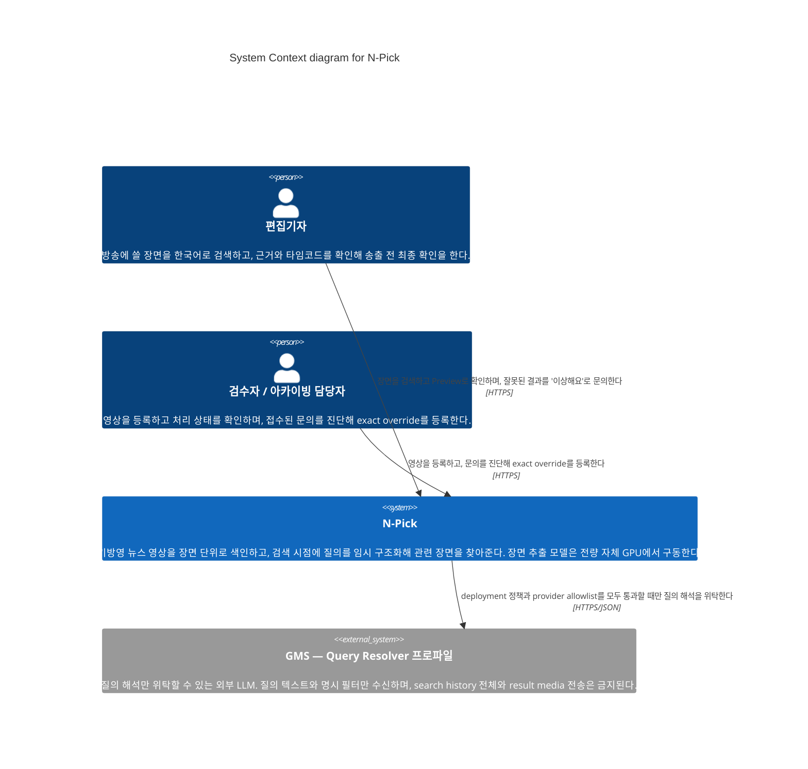

# Level 1 — System Context — N-Pick

> **다이어그램 유형**: System Context (C4 레벨 1)
> **범위**: N-Pick 시스템 전체, 그 사용자, 그리고 경계 밖 시스템
> **청중**: 팀 전원과 발표 청중. 기술 배경이 없어도 읽을 수 있어야 한다.
> **문서 상태**: **아키텍처 SSOT** · P0 설계 확정본 · 최종 수정 2026-09-02
> **기준 문서**: Notion `N-Pick-FRD-v2.2` — 본문의 모든 `§` 참조는 이 문서 기준이다
> **제품명**: 산출물과 기준 문서의 표기는 **N-Pick**으로 통일한다
> **기술 스택 정본**: [02 Container](./02-container.md)의 *요소* 표. 다른 문서의 기술 표기가 어긋나면 그 표를 따른다
> **세트 구성**: [01 Context](./01-context.md) · [02 Container](./02-container.md) · [03 Deployment](./03-deployment.md)

## 개요

N-Pick은 기방영 뉴스 영상을 장면 단위로 처리·색인하고, 편집기자가 한국어로 검색하면 검색 시점에 질의를 good-enough 구조로 임시 해석해 관련 장면을 찾아주는 로컬 중심 시스템이다.

이 다이어그램이 답하는 질문은 두 가지다. **누가 이 시스템을 쓰는가**, 그리고 **시스템 경계 밖으로 무엇이 나가는가**.

두 번째가 특히 중요하다. 코퍼스에 저작권 영상이 포함되므로 원본·keyframe·audio가 시스템을 벗어나면 안 된다. 장면 추출 모델(VLM·OCR·ASR)을 전량 자체 GPU에서 구동하기로 한 결과, 경계를 넘는 것은 **질의 텍스트와 명시 필터뿐**이고 그마저 정책이 허용할 때만이다. 이 사실이 다이어그램 한 장에 드러나는 것이 이 레벨의 목적이다.

## 다이어그램

## 범례

- **Person / 액터**: 시스템을 사용하는 사람
- **System (범위 안)**: 이 다이어그램이 다루는 시스템
- **External system**: 범위 밖이지만 상호작용하는 시스템
- 색·모양·아이콘 커스터마이즈 없음 — Mermaid C4 기본 렌더만 사용

### 용어

| 약어 | 뜻 |
| --- | --- |
| GMS | 외부 LLM 제공 서비스. component별 payload 범위를 versioned provider profile로 관리한다 |
| override | 검수자가 특정 질의에 대해 등록하는 exact 보정. `resolution_patch`와 `exclude_scene` 두 종류 |
| Preview | 검색 결과 장면의 타임코드 구간 재생 |

## 요소

| 요소 | 유형 | 기술 | 책임 |
| --- | --- | --- | --- |
| 편집기자 (`editor`) | Person | — | 한국어 검색, 근거·타임코드 확인, Preview, `이상해요` 문의, 송출 전 최종 확인. override 생성·해제와 원천·피처 직접 수정은 불가 |
| 검수자 / 아카이빙 담당자 (`reviewer`) | Person | — | 영상 등록·처리 상태 확인, 접수 문의 진단, exact override 등록·버전 갱신·해제, replay 확인. 문의 없는 전수 사전검수는 하지 않음 |
| N-Pick | System (범위 안) | — | 장면 색인, 검색 시점 질의 해석, 명백한 오사용의 보수적 차단, reactive override |
| GMS — Query Resolver 프로파일 | External system | 외부 LLM | 질의 텍스트와 명시 필터를 받아 구조화 결과를 반환. 조건부 |

## 주요 관계

| From | To | 의도 | 프로토콜 |
| --- | --- | --- | --- |
| 편집기자 | N-Pick | 장면 검색, Preview 확인, 잘못된 결과 문의 | HTTPS |
| 검수자 | N-Pick | 영상 등록, 문의 진단, exact override 등록 | HTTPS |
| N-Pick | GMS | 정책 통과 시 질의 해석 위탁 | HTTPS/JSON |

## 주목할 아키텍처 결정

- **장면 추출 모델을 자체 GPU에서 전량 구동한다.** 이 결정 하나로 Context에서 외부 시스템이 셋에서 하나로 줄었다. 영상·keyframe·audio가 경계를 넘지 않으므로 저작권 영상 반출 위험이 구조적으로 제거된다.
- **외부로 나갈 수 있는 유일한 payload는 질의 텍스트와 명시 필터다.** 그마저 deployment 레벨 플래그와 provider allowlist를 모두 통과해야 한다. 불통과 시 로컬 어댑터로 처리한다.
- **역할별 capability를 서버가 구분한다.** 다만 이는 운영급 인증·인가 시스템을 뜻하지 않는다. `reviewer_id`와 `editor_id`는 클라이언트가 보내는 자유 문자열이 아니라 서버가 현재 actor에서 기록한다.
- **영상 코퍼스 반입을 외부 시스템으로 모델링하지 않았다.** MAM 실연동이 범위 밖이고 자동 연동 대상이 없으므로, 반입은 검수자의 파일 업로드 행위다.

## 가정

- **리졸버가 실제로 GMS를 쓸지 아직 미정이다.** EC2에서 도는 소형 모델일 수도 있다. 어댑터 경계 뒤에 있으므로 이 다이어그램은 두 경우 모두에 유효하다. GMS를 쓰기로 하면 provider profile 등록이 선행되어야 한다.
- **VLM·OCR·ASR의 외부 위탁 경로는 그리지 않았다.** 정책상 조건부로 허용되지만 자체 GPU 구동으로 결정되어 P0에서 사용하지 않는다.

## 다른 레벨로의 링크

- ↓ [Level 2 — Container](./02-container.md) — 시스템 내부의 독립 배포 단위
- 참고: [Deployment](./03-deployment.md) — 각 컨테이너가 어디서 도는가
