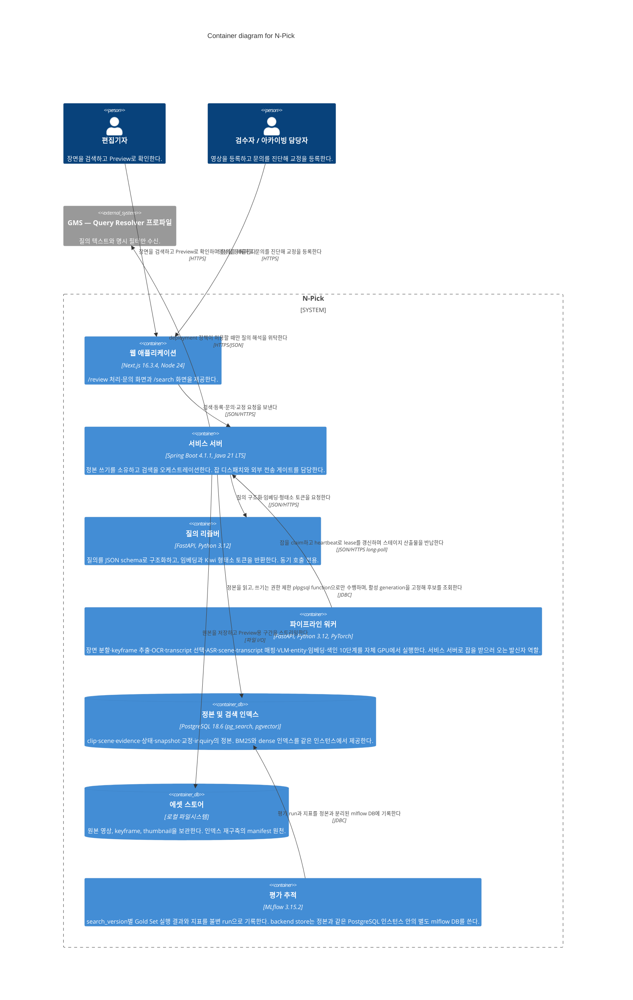

# Level 2 — Container — N-Pick

> **다이어그램 유형**: Container (C4 레벨 2)
> **범위**: N-Pick 시스템 안에서 독립적으로 배포되는 애플리케이션과 데이터 저장소, 그리고 그들 사이의 통신
> **청중**: 개발자, 인프라 담당자
> **문서 상태**: **아키텍처 SSOT** · P0 설계 확정본 · 최종 수정 2026-09-02
> **기준 문서**: Notion `N-Pick-FRD-v3.2` — 본문의 모든 `§` 참조는 이 문서 기준이다
> **제품명**: 산출물과 기준 문서의 표기는 **N-Pick**으로 통일한다
> **기술 스택 정본**: [02 Container](./02-container.md)의 *요소* 표. 다른 문서의 기술 표기가 어긋나면 그 표를 따른다
> **세트 구성**: [01 Context](./01-context.md) · [02 Container](./02-container.md) · [03 Deployment](./03-deployment.md)

## 개요

이 다이어그램은 N-Pick이 어떤 독립 배포 단위로 쪼개지고 서로 무슨 프로토콜로 말하는지 보여준다. **어느 머신에서 도는지는 여기 없다** — 그건 [Deployment](./03-deployment.md)의 일이다.

구조를 결정한 것은 두 가지 성격의 작업이 섞여 있다는 사실이다. 검색은 p95 10초 안에 끝나야 하는 동기 작업이고, 장면 처리는 클립 하나에 몇 분씩 GPU를 물고 있는 비동기 작업이다. 한 프로세스에 넣으면 배치가 도는 동안 검색이 죽는다. 그래서 AI 코드는 하나의 저장소를 공유하되 **질의 리졸버**와 **파이프라인 워커** 두 컨테이너로 나뉘어 배포된다.

두 번째 축은 정본의 소유권이다. 검색 완료는 resolution snapshot, result snapshot, 결과 행, 적용된 교정 규칙 링크, execution 종료 상태를 **한 트랜잭션에** 커밋해야 한다. 이 계약을 지키려면 랭킹 계산과 트랜잭션 커밋이 같은 프로세스에 있어야 하므로, RRF 결합과 false-hit guard는 서비스 서버가 수행하고 AI 컨테이너는 모델 추론만 담당한다.

## 다이어그램

## 범례

- **Container**: 독립적으로 배포되는 애플리케이션 또는 데이터 저장소
- **ContainerDb**: 데이터를 보관하는 컨테이너
- **External system**: 시스템 경계 밖
- 색·모양·아이콘 커스터마이즈 없음 — Mermaid C4 기본 렌더만 사용

### 용어

| 약어 | 뜻 |
| --- | --- |
| BM25 | 어휘 기반 랭킹 함수. 검색의 lexical backbone |
| dense | 텍스트 임베딩 벡터를 이용한 의미 기반 후보 검색. 보조 채널 |
| RRF | Reciprocal Rank Fusion. BM25 순위와 dense 순위를 결합하는 방식 |
| generation | 색인 문서 한 세대. `building → ready → active → superseded`로 전이하며 활성은 항상 1개 |
| Kiwi | 한국어 형태소 분석기. 색인과 질의 양쪽에서 동일 설정으로 사용 |
| pg_search | PostgreSQL의 BM25 인덱스 확장 (Tantivy 기반) |
| pgvector | PostgreSQL의 벡터 검색 확장 |

## 요소

> 이 표가 **기술 스택의 정본**이다. Deployment 문서는 배치 위치를 다루며 기술 표기는 여기를 따른다.
>
> **버전 정본은 저장소 매니페스트다** — `frontend/package.json`, `backend/build.gradle`, `ai/pyproject.toml`. 매니페스트를 올릴 때 이 표도 같이 올린다.
>
> **DB 행은 반영 완료다** (`S15P21A501-151`). `compose.yaml`이 `paradedb/paradedb:0.25.6-pg18`을 쓰며, 컨테이너에서 PostgreSQL 18.6 · pg_search 0.25.6 · pgvector 0.8.4로 실측 확인했다.

| 요소 | 유형 | 기술 | 책임 |
| --- | --- | --- | --- |
| 웹 애플리케이션 | Container | Next.js 16.3.4 (Turbopack), Node 24 | `/review` 처리·문의 화면과 `/search` 화면 |
| 서비스 서버 | Container | Spring Boot 4.1.1, Java 21 LTS | 정본 쓰기 소유, 검색 오케스트레이션(RRF·guard·Top 10 보충), 잡 디스패치, 외부 전송 게이트와 감사 기록 |
| 질의 리졸버 | Container | FastAPI, Python 3.12 | 질의 구조화, 질의 임베딩, Kiwi 형태소 토큰화. 동기 호출 전용이며 재시도 없음 |
| 파이프라인 워커 | Container | FastAPI, Python 3.12, PyTorch | 장면 분할, keyframe 추출, OCR, transcript 선택, ASR, scene-transcript 매핑, VLM 메타데이터, entity 추출, 텍스트 임베딩, 색인 (10단계) |
| 정본 및 검색 인덱스 | ContainerDb | PostgreSQL 18.6 + pg_search 0.25.6 + pgvector 0.8.4 | 모든 ID·관계·상태·snapshot·교정·inquiry의 정본이자 BM25·dense 인덱스 |
| 에셋 스토어 | ContainerDb | 로컬 파일시스템 | 원본 영상, keyframe, thumbnail. 인덱스 재구축 시 manifest 원천 |
| 평가 추적 | Container | MLflow 3.15.2 (backend store: 같은 인스턴스의 별도 `mlflow` DB) | search_version별 파라미터·지표·artifact를 불변 run으로 기록 |

## 주요 관계

| From | To | 의도 | 프로토콜 |
| --- | --- | --- | --- |
| 편집기자 | 웹 애플리케이션 | 검색, Preview, 문의 제출 | HTTPS |
| 검수자 | 웹 애플리케이션 | 영상 등록, 문의 진단, 교정 등록 | HTTPS |
| 웹 애플리케이션 | 서비스 서버 | 검색·등록·문의·교정 요청 | JSON/HTTPS |
| 서비스 서버 | 정본 및 검색 인덱스 | 정본 읽기, plpgsql function을 통한 쓰기, 활성 generation 고정 후보 조회 | JDBC |
| 서비스 서버 | 질의 리졸버 | 질의 구조화·임베딩·형태소 토큰 요청 | JSON/HTTPS |
| 서비스 서버 | 에셋 스토어 | 원본 저장, Preview 구간 스트리밍 | 파일 I/O |
| 파이프라인 워커 | 서비스 서버 | 잡 claim, heartbeat lease 갱신, 스테이지 산출물 반납 | JSON/HTTPS long-poll |
| 평가 추적 | 정본 및 검색 인덱스 | 평가 run과 지표를 별도 `mlflow` DB에 기록 | JDBC |
| 서비스 서버 | GMS | 정책 통과 시 질의 해석 위탁 | HTTPS/JSON |

## 주목할 아키텍처 결정

- **검색 인덱스를 별도 시스템이 아니라 PostgreSQL 확장으로 둔다.** PoC로 검증한 결과 `generation_id` 필터가 BM25 조회와 함께 Custom Scan 내부에서 처리되어(실측 1.5ms) 세대 격리에 alias가 필요 없다. 인덱스가 정본과 같은 트랜잭션 안에 있으므로 transactional outbox, idempotent consumer, reconciliation job이 통째로 불필요해진다. 문서 수가 약 2,200개라 외부 검색 엔진이 필요한 규모도 아니다.

- **형태소 분석을 DB가 아니라 파이프라인에서 한다.** PoC에서 `lindera(korean)` 토크나이저는 조사를 전혀 제거하지 못했고(`정체를` 질의에 무관 문서가 `를` 토큰만으로 매칭되어 정답보다 높은 점수를 받음), 사용자 사전도 지원하지 않는다(확장 소스 확인). 대신 워커가 Kiwi로 토큰화한 결과를 별도 컬럼에 넣고 `pdb.whitespace` 토크나이저로 색인한다. 형태소 품질은 Kiwi가, BM25 스코어링은 Tantivy가 담당한다. **색인과 질의가 동일한 Kiwi 설정을 써야 하며, 다르면 검색이 0건이 된다.** 이 설정은 `search_version`에 묶는다.

- **AI 코드는 저장소 하나, 배포 단위 둘.** 리졸버는 검색 예산 안에서 동기로 돌고 워커는 GPU를 오래 물고 있다. 모델 어댑터 코드는 공유하고 진입점만 분리한다.

- **랭킹과 guard는 서비스 서버에 둔다.** false-hit 3값 판정은 필드별 verification 상태를 비교하는 분기 로직이고, Top 10 보충은 원래 순서를 보존해야 한다. SQL로 밀면 왜 이 순위가 나왔는지 설명할 수 없게 되고, 결과 스냅샷에 score breakdown을 남겨야 하므로 어차피 애플리케이션에 중간값이 필요하다.

- **워커가 항상 발신자다.** 서비스 서버가 잡 API(`claim` / `heartbeat` / `complete` / `artifacts`)를 노출하고 워커가 long-poll한다. 워커는 DB에 직접 접속하지 않는다.

- **에셋 스토어를 컨테이너로 명시했다.** 색인 전체를 정본과 asset manifest에서 재구축할 수 있어야 한다는 요구가 있으므로, 빼면 재구축 계약이 그림에서 사라진다.

- **nginx와 Jenkins는 이 다이어그램에 없다.** Container는 독립 배포되는 *런타임*인데, 리버스 프록시는 우리 코드를 담지 않는 인프라이고 Jenkins는 시스템을 만드는 빌드 인프라다. 둘 다 [Deployment](./03-deployment.md)에 있다.

- **평가 추적은 정본과 같은 PostgreSQL 인스턴스 안의 별도 `mlflow` DB를 쓴다.** SQLite 파일도 후보였고 동시 사용자가 1명이라 성립하지만, 채택하지 않았다. 이유는 두 가지다. 첫째, FRD §9.2의 "동시 사용자 1명"은 사용자 부하의 상한일 뿐 배경 작업 동시성을 없애주지 않으며, 평가 ablation을 여러 설정으로 병렬 실행하면 SQLite가 `database is locked`를 낸다. 둘째, 저장소를 하나로 유지하면 백업 대상과 접근 경로가 한 곳이고 나중에 옮길 일이 없다. **격리는 DB와 role 분리로 확보한다** (`S15P21A501-151`) — 같은 인스턴스 안에 별도 `mlflow` DB와 `mlflow` role을 만들고, `ALTER ROLE mlflow CONNECTION LIMIT 20`으로 실험 트래픽이 서비스 커넥션을 잠식하지 못하게 막으며, `REVOKE CONNECT ON DATABASE <서비스DB> FROM mlflow`로 교차 접근을 차단한다. 스키마 분리로는 이 둘을 걸 수 없어 DB 분리를 쓴다. 아래 정본 쓰기 규칙은 평가 DB에 적용되지 않는다.

- **정본 쓰기는 권한 제한 plpgsql function으로만 한다.** inquiry claim, 교정 승격·해제(promotion·revoke), generation promotion, clip ready 전환은 전부 DB function 안에서만 일어나고 애플리케이션 role의 직접 쓰기는 금지된다. append-only 테이블은 전용 insert function과 `UPDATE`/`DELETE` 차단 트리거로 보호한다. "그런 엔드포인트를 안 만들면 된다"는 허용되지 않는 답이다.

## 가정

- **질의 리졸버가 사용할 LLM이 미정이다.** GMS 또는 EC2에서 도는 소형 모델. 어댑터 경계 뒤에 있어 이 다이어그램은 두 경우 모두에 유효하다.
- **`웹 애플리케이션 → 서비스 서버` 호출은 브라우저에서 nginx를 거쳐 이뤄진다.** Next.js 서버가 프록시하지 않는다.
- **EC2는 Ubuntu 24.04.4 LTS, 4 vCPU / 15GB RAM으로 확인되었다.** 호스트 포트 배정은 [Deployment](./03-deployment.md)를 따른다 — 서비스 서버가 8080을 쓰고 Jenkins가 18080으로 비켜났다(`S15P21A501-151`). 앱 서비스는 모두 `127.0.0.1`에만 바인딩된다.

## 저장소 매핑

| Container | 저장소 디렉터리 |
| --- | --- |
| 웹 애플리케이션 | `frontend/` |
| 서비스 서버 | `backend/` |
| 질의 리졸버 · 파이프라인 워커 | `ai/` (현재 `ai-worker` 한 컨테이너 — 리졸버·워커 아직 미분리) |
| 배포·설정 | `infra/` — `compose.yaml`(루트), `infra/compose/profiles/` |

## 설정 프로필 계층

미디어·파이프라인·런타임 제약 값은 코드에 흩뿌리지 않고 `infra/compose/profiles/` 세 파일에서 관리한다.

| 파일 | 담는 것 |
| --- | --- |
| `media.yml` | 파일 크기·길이·허용 codec |
| `pipeline.yml` | 단계별 retry·timeout·동시성, CPU/GPU 배치 |
| `runtime.yml` | 타임존·로그·telemetry·bind·API 규칙 |

파이프라인 **단계 목록 자체의 정본은 `ai/src/npick_worker/stages.py`**이며 `pipeline.yml`은 각 단계의 실행 파라미터만 담는다.

## 다른 레벨로의 링크

- ↑ [Level 1 — System Context](./01-context.md) — 더 추상적인 관점
- 참고: [Deployment](./03-deployment.md) — 각 컨테이너의 배포 위치
