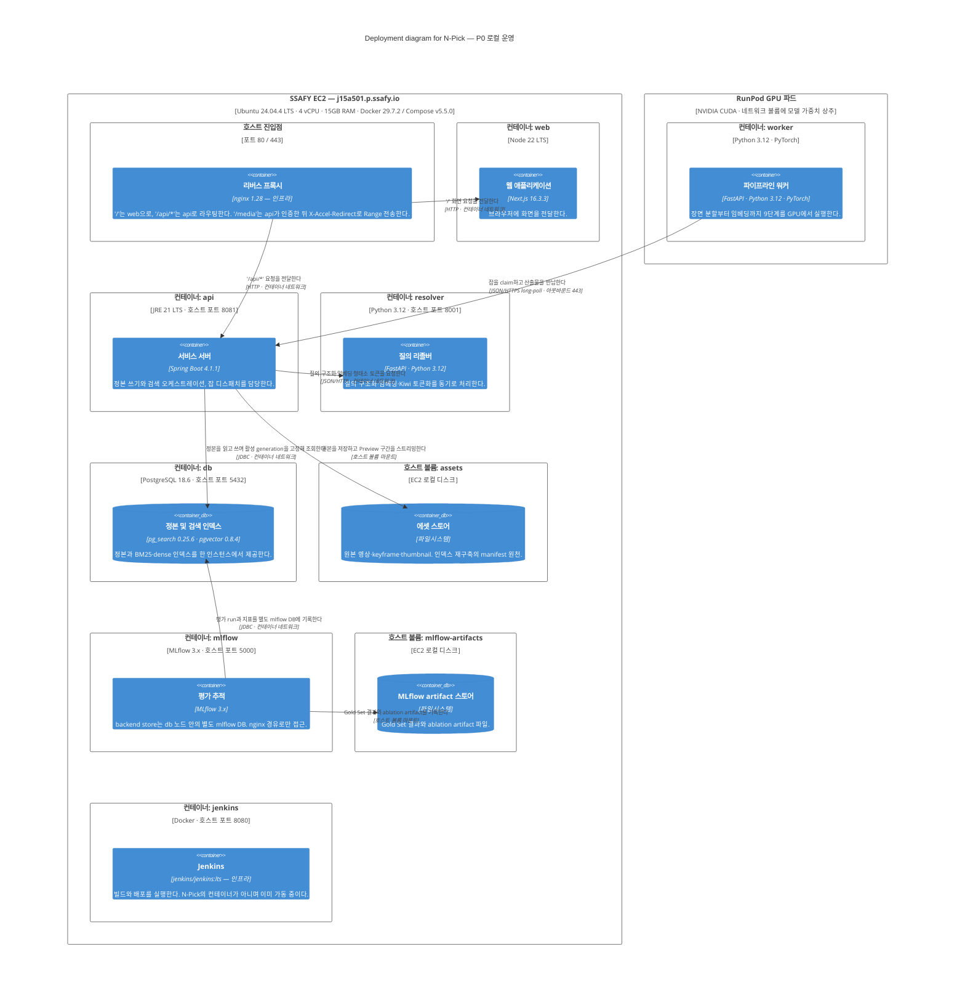

# Supporting — Deployment — N-Pick (P0)

> **다이어그램 유형**: C4 Deployment (보조 다이어그램)
> **범위**: P0 운영 환경 한 벌. [Level 2](./02-container.md)의 각 컨테이너가 실제로 어느 노드에서 도는가
> **청중**: 인프라 담당자, CI/CD 담당자
> **문서 상태**: **아키텍처 SSOT** · P0 설계 확정본 · 최종 수정 2026-09-02
> **기준 문서**: Notion `NewsCut-FRD-v2.2` — 본문의 모든 `§` 참조는 이 문서 기준이다
> **제품명**: 산출물 표기는 **N-Pick**이다. 기준 FRD는 아직 `NewsCut` 표기를 쓰며 정정은 미승인 상태다
> **기술 스택 정본**: [02 Container](./02-container.md)의 *요소* 표. 다른 문서의 기술 표기가 어긋나면 그 표를 따른다
> **세트 구성**: [01 Context](./01-context.md) · [02 Container](./02-container.md) · [03 Deployment](./03-deployment.md)

## 개요

N-Pick은 노드 두 개로 운영된다. SSAFY EC2(`j15a501.p.ssafy.io`) 한 대가 사용자 대면 경로 전부와 정본을 담고, RunPod GPU 파드가 장면 처리만 맡는다.

이 다이어그램의 핵심은 **두 노드 사이에 화살표가 단 하나이고 방향이 GPU → EC2**라는 점이다. 워커가 항상 발신자이므로 GPU 파드에 인바운드 포트를 열 필요가 없고, EC2의 보안 그룹에도 GPU 쪽을 위한 규칙이 없다. 파드가 죽거나 요금 절약을 위해 내려가도 lease 만료로 회수되므로 잡이 유실되지 않는다.

nginx와 Jenkins가 여기 있고 [Container 다이어그램](./02-container.md)에는 없는 이유도 이 문서가 설명한다. 둘 다 N-Pick의 코드를 담지 않는 인프라이며, 이 문서에서는 기술란에 `— 인프라`를 붙여 구분한다.

## 다이어그램

## 범례

- **Deployment_Node**: 소프트웨어가 실행되는 물리적/논리적 위치. 중첩 가능
- **Container / ContainerDb**: [Level 2](./02-container.md)와 동일한 컨테이너가 그 노드에 배치된 것
- **기술란의 `— 인프라`**: N-Pick의 컨테이너가 아니라 배포 인프라. nginx와 Jenkins가 여기 해당한다
- 색·모양·아이콘 커스터마이즈 없음 — Mermaid C4 기본 렌더만 사용

> **Container 다이어그램과 화살표가 다른 이유**: [Level 2](./02-container.md)는 `웹 애플리케이션 → 서비스 서버`를 그린다. 이는 브라우저에서 도는 클라이언트 코드가 API를 호출한다는 C4 관례 표기다. 배포 관점에서는 그 트래픽이 nginx를 거치므로 여기서는 `리버스 프록시 → web`과 `리버스 프록시 → api` 두 화살표로 나뉜다. 같은 사실의 다른 관점이며 모순이 아니다.

## 요소

| 노드 | 유형 | 담고 있는 것 | 비고 |
| --- | --- | --- | --- |
| SSAFY EC2 (`j15a501.p.ssafy.io`) | Deployment_Node | 사용자 대면 경로 전부와 정본 | Ubuntu 24.04.4 LTS (noble), 커널 6.17.0-aws, 4 vCPU / 15GB RAM / 305GB 여유. swap 없음 |
| 호스트 진입점 | Deployment_Node | 리버스 프록시 (nginx 1.28) | 포트 80/443. 확인 시점 기준 미설치 |
| 컨테이너: web | Deployment_Node | 웹 애플리케이션 | Node 22 LTS |
| 컨테이너: api | Deployment_Node | 서비스 서버 | JRE 21 LTS. **호스트 포트 8081** — 8080은 Jenkins가 선점 |
| 컨테이너: resolver | Deployment_Node | 질의 리졸버 | FastAPI, Python 3.12 |
| 컨테이너: db | Deployment_Node | 정본 및 검색 인덱스 | PostgreSQL 18.6 + pg_search 0.25.6 + pgvector 0.8.4 |
| 호스트 볼륨: assets | Deployment_Node | 에셋 스토어 | named volume `npick-media` → `/srv/npick/media`. backend와 ai-worker가 **공유 마운트** |
| 컨테이너: mlflow | Deployment_Node | 평가 추적 | backend store는 `db` 노드 안의 별도 `mlflow` DB. **호스트 포트를 노출하지 않고 nginx 경유로만 접근** |
| 호스트 볼륨: mlflow-artifacts | Deployment_Node | MLflow artifact 스토어 | run 메타데이터는 `db`에 있음 |
| 컨테이너: jenkins | Deployment_Node | Jenkins (인프라) | `jenkins/jenkins:lts`, 호스트 포트 8080. **이미 가동 중** |
| RunPod GPU 파드 | Deployment_Node | 파이프라인 워커 | NVIDIA CUDA. 모델 가중치는 네트워크 볼륨 |

## 주요 관계

| From | To | 의도 | 프로토콜 |
| --- | --- | --- | --- |
| 리버스 프록시 | 웹 애플리케이션 | `/` 화면 요청 전달 | HTTP, 컨테이너 네트워크 |
| 리버스 프록시 | 서비스 서버 | `/api/*` 요청 전달 | HTTP, 컨테이너 네트워크 |
| 서비스 서버 | 정본 및 검색 인덱스 | 정본 읽기·쓰기, 활성 generation 고정 조회 | JDBC, 컨테이너 네트워크 |
| 서비스 서버 | 질의 리졸버 | 질의 구조화·임베딩·토큰화 요청 | JSON/HTTP, 컨테이너 네트워크 |
| 서비스 서버 | 에셋 스토어 | 원본 저장, Preview 스트리밍 | 호스트 볼륨 마운트 |
| 평가 추적 | 정본 및 검색 인덱스 | 평가 run·지표를 별도 `mlflow` DB에 기록 | JDBC, 컨테이너 네트워크 |
| 평가 추적 | MLflow artifact 스토어 | Gold Set 결과·ablation artifact 기록 | 호스트 볼륨 마운트 |
| 파이프라인 워커 | 서비스 서버 | 잡 claim, 산출물 반납 | JSON/HTTPS long-poll, 아웃바운드 443 |

## 주목할 아키텍처 결정

- **노드 간 화살표가 하나, 방향은 GPU → EC2다.** RunPod 파드는 아웃바운드만 있으면 되므로 인바운드 포트 노출과 프록시 URL 설정이 전부 불필요하다. EC2 보안 그룹에도 GPU를 위한 규칙이 없다. 파드 IP가 바뀌어도 아무것도 고칠 필요가 없다.

- **모델 가중치는 RunPod 네트워크 볼륨에 두거나 커스텀 이미지에 굽는다.** 컨테이너 디스크가 휘발성이므로 Whisper와 VLM 가중치 수 GB를 파드를 띄울 때마다 다시 받으면 배치마다 수십 분을 버린다.

- **파드를 배치 사이에 내려도 안전하다.** 시간당 과금이므로 내리는 편이 낫고, 잡 중간에 파드가 죽어도 lease 만료로 서비스 서버가 회수한다. 스테이지 단위로 산출물이 반납되므로 재시도가 성공한 스테이지를 다시 실행하지 않는다.

- **성능 수치에 GPU 모델을 반드시 기록한다.** RunPod은 실행할 때마다 GPU 종류가 달라질 수 있다. 333클립 배치 목표 시간을 측정할 때 GPU 모델을 benchmark profile에 남기지 않으면 그 수치는 재현 불가능하고 합격 근거로 쓸 수 없다.

- **검색 경로가 GPU 서버에 의존하지 않는다.** 질의 리졸버를 EC2에 남겨, GPU 파드가 내려가 있어도 검색은 계속 동작하고 색인만 멈춘다. 검색 p95 목표가 대여 GPU의 가용성과 네트워크에 묶이지 않는다.

- **서비스 서버는 호스트 포트 8081을 쓴다.** 8080은 이미 Jenkins 컨테이너가 점유하고 있다(확인 시점 기준 가동 중). 컨테이너 내부 포트는 8080 그대로 두고 퍼블리시만 8081로 매핑한다.

- **평가 추적은 정본과 같은 PostgreSQL 인스턴스를 공유하되 별도 DB와 role로 격리한다** (`S15P21A501-151`). SQLite 파일도 후보였으나, "동시 사용자 1명"은 사용자 부하의 상한일 뿐이고 ablation을 병렬로 돌리면 `database is locked`가 난다. 저장소를 하나로 유지하면 백업 대상과 접근 경로가 한 곳이고 나중에 옮길 일도 없다. role 단위 `CONNECTION LIMIT`과 `REVOKE CONNECT`로 실험 트래픽이 서비스 커넥션을 잠식하거나 정본에 닿는 것을 막는다. artifact 파일만 별도 호스트 볼륨에 남는다.

- **Jenkins는 `dev` 머지 시 변경된 앱만 빌드한다.** 모노레포이므로 매번 전체를 빌드하면 CI가 길어진다. GPU 파드 배포는 `ai/`가 바뀔 때만 수행한다.

## 가정

- **swap이 0이다.** 15GB RAM에 컨테이너 7개(nginx · web · api · resolver · db · mlflow · jenkins)가 올라가므로 여유는 있으나, 색인 재구축이나 PostgreSQL `maintenance_work_mem` 상향 시 OOM 여지가 있다. 필요해지면 swapfile을 추가한다.
- **nginx는 아직 설치되지 않았다.** 확인 시점에 80/443이 비어 있었다. 컨테이너로 띄울지 호스트 패키지로 설치할지는 미정이다.
- **에셋 스토어는 named volume `npick-media`다.** `/srv/npick/media`로 backend와 AI 워커가 공유 마운트한다. 오브젝트 스토리지는 검토하지 않았다.
- **질의 리졸버가 사용할 LLM이 미정이다.** GMS 또는 EC2에서 도는 소형 모델. 어느 쪽이든 이 배포도는 바뀌지 않는다.
- **환경은 P0 한 벌뿐이다.** dev/staging 분리가 없으므로 이 문서가 유일한 배포도다.

## 다른 레벨로의 링크

- ↑ [Level 1 — System Context](./01-context.md)
- ↑ [Level 2 — Container](./02-container.md) — 여기 배치된 컨테이너들의 책임과 통신
